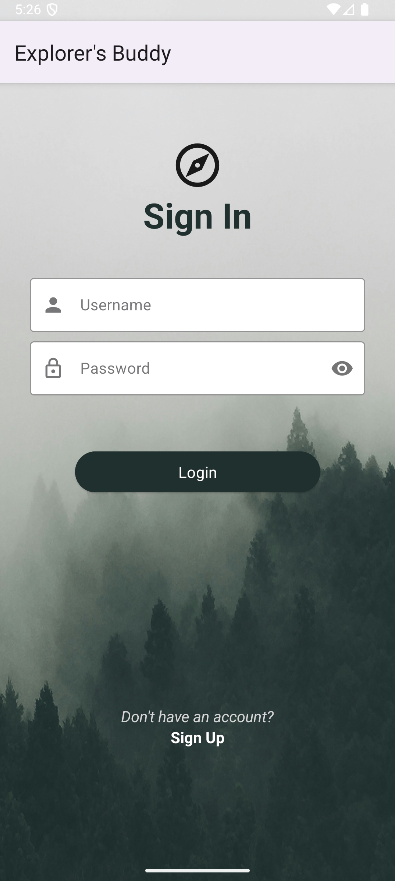
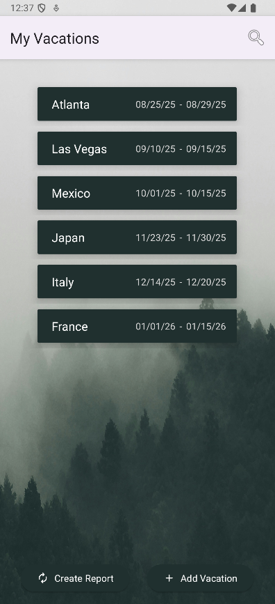
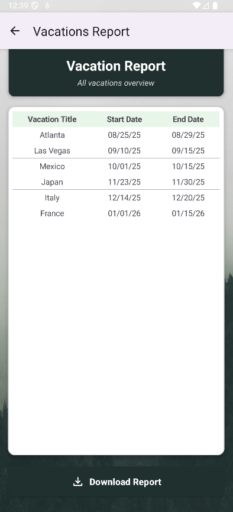

# Explorer’s Buddy (Vacation Planner)

  

## Overview
Explorer’s Buddy is a native Android application designed to help users track vacations, manage excursions, and maintain a travel history. It solves the problem of scattered travel details by centralizing itineraries, alerts, and reporting into a single interface.

This project was developed as a Capstone for my Software Engineering degree at WGU, demonstrating full-cycle mobile development from UI design to APK deployment.

## Key Features
* **User Authentication:** Secure registration and login functionality with input validation.
* **Itinerary Management:** Full CRUD (Create, Read, Update, Delete) capabilities for Vacations and associated Excursions.
* **Smart Alerts:** Automated notifications via the `AlarmManager` API for trip start/end dates.
* **Reporting:** Generates and downloads detailed PDF reports of vacation history.
* **Sharing:** Integrated `Intent` sharing to send trip details to external apps (SMS, Email, Social).
* **Search & Filter:** Dynamic search logic to filter upcoming trips in real-time.

## Tech Stack
* **Language:** Java
* **UI Toolkit:** Android Views (XML Layouts)
* **Architecture:** MVVM (Model-View-ViewModel) pattern
* **Database:** Room Persistence Library
* **Version Control:** Git / GitLab / GitHub
* **Build Tool:** Gradle
* **Testing:** JUnit (Unit Testing)

## Screenshots
|        Login Screen        |      Vacation List       |          PDF Report          |
|:--------------------------:|:------------------------:|:----------------------------:|
|  |  |  |

## Installation & Setup
**Prerequisites:**
* Android Studio Ladybug (or higher)
* Minimum SDK: API 26 (Android 8.0)
* Target SDK: API 36 (Android 16 Developer Preview)

**Steps:**
1.  Clone the repository:
    ```bash
    git clone [https://github.com/bekscode/Vacation-Planner-v2.git](https://github.com/bekscode/Vacation-Planner-v2.git)
    ```
2.  Open the project in **Android Studio**.
3.  Sync Gradle files.
4.  Run on an Emulator or physical device connected via USB.

---

## User Guide
<details>
<summary><strong>Registration and Login (Click to Expand)</strong></summary>

### Registering an Account
1. Open the app to the *Sign In* screen.
2. Tap *Sign Up*.
3. Enter a unique *Username*.
4. Enter a *Password* (Must be 8+ chars, 1 uppercase, 1 lowercase, 1 number).
5. Confirm password and tap *Register*.

### Logging In
1. Enter your credentials and tap *Login* to access the *My Vacations* dashboard.
</details>

<details>
<summary><strong>Managing Vacations & Excursions</strong></summary>

### Vacations
* **Create:** Tap the `+ Add Vacation` button, enter Title, Hotel, Start/End Dates, and Save.
* **Update:** Tap an existing vacation, edit fields, and tap Save.
* **Delete:** Select a vacation -> Menu -> *Delete Vacation*.
* **Search:** Tap the magnifying glass and type to filter results.

### Excursions
* **Add:** Inside a Vacation, tap the `+ Add Excursion` button to add an excursion title and date.
* **Delete:** Inside a Vacation, select Excursion -> Menu -> *Delete Excursion*.
</details>

<details>
<summary><strong>Advanced Features (Reports & Sharing)</strong></summary>

### Notifications
Select a vacation or excursion -> Menu -> *Notify*. Alerts will trigger based on the system clock.

### Sharing
Select a vacation -> Menu -> *Share*. Uses Android System Intent to share details via text, email, or social media.

### PDF Reports
Tap *Create Report* on the dashboard to generate a downloadable PDF of all saved data using the Android PDFDocument API.
</details>

---

## Author
**Rebekah Romang**
* https://www.linkedin.com/in/rebekahromang/


## License
This project is for educational purposes as part of the WGU Software Engineering program.